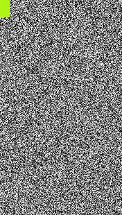

# QIG : quick image generator



QIG generates unique images from noise *en masse*, and inside of them a random
colored rectangle of a random size to ensure uniqueness.

## Features

- Uses multi processing for even faster image generation
- Images and their filenames are unique
- Support for many formats : "jpeg", "jpg", "png", "gif", "webp", "heic",
  "heif", "avif", "bmp", "pdf", "tiff"
- Random formats and resolutions are available, the top left rectangle will be
  transparent if the format support transparence.

## Usage

*For convenience, some independant binaries are available in [Github's release](https://github.com/mascaldotfr/qig/releases)*

```
pip install -r requirements.txt
# We generate 100 images of random format with size 2000x1500
python3 qig.py -n 100  -f random -r 2000x1500 /some/where
# We generate 100 JPEG images with some random size between 32 and 2560
python3 qig.py -n 100  -f jpg -r random /some/where
```

For more informations see `python3 qig.py -h`

## Caveats

### Limits

- The maximum number of images generated in a single batch is 100000 to avoid excessive
  overhead or resource exhaustion. This can be overriden easily by modifying
  `qig.py`.
- You can't generate pictures with size smaller than 32 pixels (height and width)
